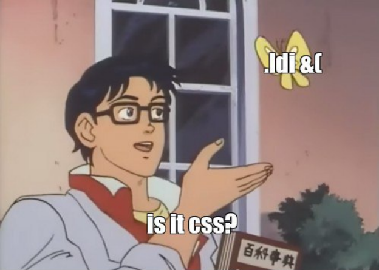

# Introduction

##                                       Ancient Virtual Machine


> Ancient VM proof of concept of the language, toolkit, virtual machine and ecosystem A VM with 50+ instructions, SIMD Vector calculation, modularity, language and compiler, CLI tool and package register of modules and extensions

## 📡 Installation

```bash
$ yarn global add @rune-temp/cli
$ rune install vm
```

## 💻 OS Support

| OS | Version | Architectures |
| :--- | :--- | :--- |
| Windows 10 | 1607+ | x64, ARM32 |
| OSX | 10.14+ | x64 |
| Linux |  | x64, ARM32, ARM64 |



 by [@ViktorChernyaev](https://github.com/ViktorChernyaev)

### History

Once i read an [article on Wikipedia](https://en.wikibooks.org/wiki/Creating_a_Virtual_Machine/Register_VM_in_C) about writing custom VM and interpreter bytecode.  
So, i wanted to give it a try. Initially, i planned to write a 4-bit CPU emulator, afterwards i wrote it - but with the development of the source code, bit rate of instructions increased, and emulator has a programming language that is very similar to Assembler language \(and CSS, yeah\).  
It was a wonderful experience, i faced unusual problems and came up with quite unusual solutions.  
Since then, i continued to develop and improve different kinds of features in this project afterwards.  
I do not pursue any goals \(except of course vm speed and language usability\), and i do not expect my VM to be useful - but if you have any ideas on how to improve the project I’d be happy to hear from you.


 


